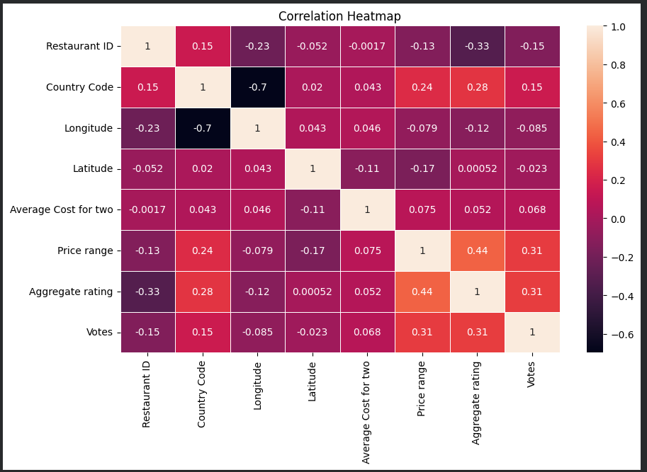
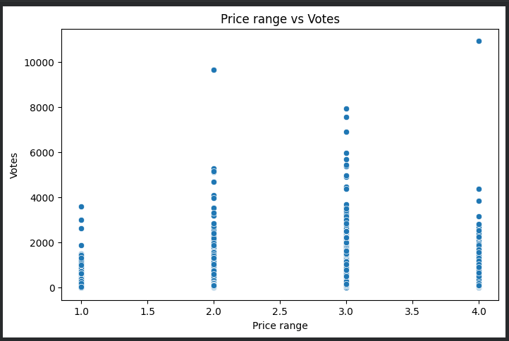
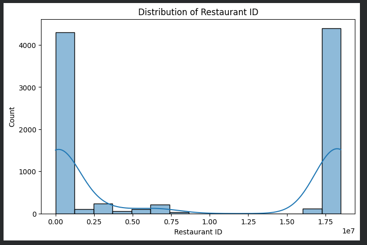

# Zomato Dataset Exploratory Data Analysis (EDA)

## Project Overview
This project performs Exploratory Data Analysis (EDA) on the Zomato restaurants dataset to understand customer preferences, pricing trends, restaurant ratings, cuisine popularity, and customer engagement using Python data analysis libraries.

---

## Technologies Used
- Python
- Pandas
- NumPy
- Matplotlib
- Seaborn
- Jupyter Notebook

---

## Key Analysis Performed
- Data Cleaning
- Missing Value Handling
- Duplicate Detection
- Outlier Detection
- Correlation Analysis
- Data Visualization
- Customer Preference Analysis
- Pricing Trend Analysis

---

## Visualizations Included
- Histograms
- Scatterplots
- Boxplots
- Correlation Heatmaps
- Cuisine Popularity Charts

---

## Key Insights
- North Indian and Chinese cuisines dominate most cities.
- Restaurants with online delivery show higher customer engagement.
- Significant outliers exist in votes and pricing columns.
- Restaurant location strongly affects pricing trends.

---

## Project Structure

zomato-dataset-eda/
│
├── zomato.csv
├── notebooks/
│   └── zomato_eda.ipynb
├── images/
├── README.md

---

## Author
Sai Krishna

---

# Project Visualizations

## Correlation Heatmap

---

## Scatter Plot Analysis

---

## Boxplot Analysis

---

## Outlier Detection

---

## Top Cuisines Analysis

